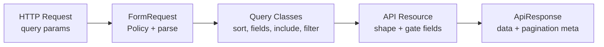

<div align="center">

# Laravel API Starter

**A production-ready Laravel 13 API with Sanctum auth, Spatie permissions, and a
query-driven resource pattern you can copy for every endpoint.**

[](https://github.com/Aontaigh/laravel-api-skeleton/actions/workflows/ci.yml)
[](https://github.com/Aontaigh/laravel-api-skeleton/releases)
[](https://www.php.net)
[](https://laravel.com)
[](LICENSE)

</div>

Ships with three fully wired resources — **Users**, **Roles**, and **API tokens** — each
implementing the same index contract (`sort`, `fields`, `include`, `filter`, pagination).
Clone, run Sail, issue a token, open **[http://localhost/api/docs](http://localhost/api/docs)**
(Scalar try-it UI), or import [docs/openapi.yaml](docs/openapi.yaml) into Postman.

Patterns align with an internal shared conventions toolkit — invokable controllers,
FormRequest validation, query classes, API Resources, and server-side Policies. Every
convention below is demonstrated in this repo, so nothing here depends on that access.

## Table of Contents

- [About](#about)
- [Quick Start](#quick-start)
- [How the Query-Driven API Works](#how-the-query-driven-api-works)
- [Documentation](#documentation)
- [Stack](#stack)
- [Requirements](#requirements)
- [API](#api)
- [API Reference](#api-reference)
- [Security](#security)
- [Architecture](#architecture)
- [File Structure](#file-structure)
- [Quality Gates](#quality-gates)
- [Testing](#testing)
- [What's Not Included](#whats-not-included)
- [License](#license)

## About

This repo is a **starter template**, not a finished product. It demonstrates conventions
you can copy into greenfield APIs or port legacy endpoints toward over time.

**What you get:**

- Paginated, filterable **user** index with team row scoping and permission-gated fields
- **Role** and **team** indexes for management UIs
- Self-service **profile** update, password change, and admin-issued **API tokens** via Sanctum
- Admin **account suspension** (suspend / unsuspend) plus a public `/health` uptime probe
- Hand-written [OpenAPI 3.1](docs/openapi.yaml) spec with hosted [Scalar](https://scalar.com) docs at `/api/docs` (local and production)
- Dockerised local dev via [Laravel Sail](https://laravel.com/docs/sail)
- 90% line-coverage CI gate with parallel quality jobs

**Who it's for:** teams bootstrapping a JSON API, architects evaluating a consistent
resource layer, or agents mapping a predictable Laravel layout.

## Quick Start

> [!IMPORTANT]
> The project requires **PHP ^8.5**. If your host PHP is older, use Sail for every
> command below (`./vendor/bin/sail …`). GitHub CI runs native PHP 8.5 — not Sail containers.

```bash
composer install
cp .env.example .env
php artisan key:generate

./vendor/bin/sail up -d
./vendor/bin/sail artisan migrate:fresh --seed
```

Seeding creates one team ("Acme Corp") and one user per role. The full permission matrix
lives in [docs/permissions.md](docs/permissions.md).

| Email | Role |
| --- | --- |
| `admin@example.com` | Admin |
| `manager@example.com` | Manager |
| `test@example.com` | User |

Issue a bearer token via login, registration, or Tinker:

```bash
curl -s -X POST http://localhost/api/login \
  -H "Content-Type: application/json" \
  -d '{"email":"test@example.com","password":"password"}' | jq -r '.data.plain_text_token'
```

Or with Tinker:

```bash
./vendor/bin/sail artisan tinker --execute="echo App\Models\User::where('email', 'admin@example.com')->first()->createToken('local')->plainTextToken;"
```

> [!TIP]
> Open [http://localhost/api/docs](http://localhost/api/docs), click **Authentication** in
> Scalar, and paste `Bearer {token}` — the fastest way to explore sort, fields, include,
> and filter on a live API. Details: [docs/api.md](docs/api.md#interactive-docs-scalar).

**Try it (curl)** — list users with team and role includes:

```bash
curl -s -H "Authorization: Bearer YOUR_TOKEN" \
  "http://localhost/api/users?fields[users]=id,name&include=team,role&per_page=5" | jq
```

All routes below require `Authorization: Bearer {token}` unless noted.

### Authentication (public)

```http
POST /api/login           # {"email": "...", "password": "...", "remember": optional, "device_name": optional}
POST /api/login/remember  # Stateful SPA re-auth via remember-me cookie or session
POST /api/register        # {"name": "...", "email": "...", "password": "...", "password_confirmation": "..."}
POST /api/oauth/token     # {"grant_type":"client_credentials","client_id":"...","client_secret":"..."}
POST /api/logout          # Bearer token required — revokes every token and server session
```

No prior token required for login, register, and client-credentials exchange. Login and register are
rate-limited per email+IP (`API_AUTH_RATE_LIMIT_PER_MINUTE`, default **5**) backed by a broad per-IP
ceiling (`API_AUTH_IP_CEILING_PER_MINUTE`, default **20**). Client-credentials exchange is rate-limited
per `client_id`+IP (`API_CLIENT_AUTH_RATE_LIMIT_PER_MINUTE`, default **5**) with the same per-IP ceiling
pattern. The per-IP ceiling is skipped in `local` so the dev suite never self-throttles. After seed,
use demo client `demo-integration-client` / `DemoClientSecret12`. Admins manage clients via
`GET|POST|DELETE /api/clients` and `GET /api/clients/{client}`. Registration assigns the default `User` role with `team_id` null and returns a Sanctum bearer token;
email verification is not required. Invalid login credentials return a generic
`Invalid Credentials` message on the `email` field. Login, logout, registration,
failed logins, and remember-me restores are recorded to `auth_audit_logs` — written by a
**queued listener** ([RecordAuthAuditLog](app/Listeners/RecordAuthAuditLog.php)) off the
request hot path, so a queue worker must be running in non-`sync` environments.

Set `remember: true` on login for industry-standard remember-me — extended Sanctum
token lifetime (`API_REMEMBER_TOKEN_EXPIRATION_DAYS`, default **365**), a rotated
`remember_token`, and a web-guard remember cookie for stateful SPAs. Call
`POST /api/login/remember` to obtain a fresh bearer token without re-entering credentials.
The session id is **regenerated at the privilege boundary** on both remember-me login and
remember-me restore, so a fixated pre-auth session id can never survive authentication.

`POST /api/logout` requires a bearer token and ends the session everywhere: all Sanctum
tokens for the User are revoked, remember-me state is cleared, the User's `session_version`
is bumped, and every server-side session row for that User is deleted. The version bump is
the driver-agnostic part — the `session.version` middleware
([EnsureSessionVersionMatches](app/Http/Middleware/EnsureSessionVersionMatches.php)) turns
away any web session stamped with a superseded version on its next request, so "log out
everywhere" holds whether sessions live in the database, Redis, or files.

**Source of Truth:** [LoginController](app/Http/Controllers/Auth/LoginController.php),
[RegisterController](app/Http/Controllers/Auth/RegisterController.php),
[LogoutController](app/Http/Controllers/Auth/LogoutController.php),
[RememberLoginController](app/Http/Controllers/Auth/RememberLoginController.php).

## How the Query-Driven API Works

Every list endpoint follows the same request pipeline. Allow-lists live in code, not
convention — unknown params return `422`.



**Source of truth:** allow-lists in [`app/Queries/*/*QueryConstraints.php`](app/Queries/),
parse grammar in [`app/Support/`](app/Support/) (`IndexSortParser`, `SearchTermParser`,
`CommaSeparatedList`, `AllowList`), authorisation in [`app/Policies/`](app/Policies/),
machine-readable contract in [docs/openapi.yaml](docs/openapi.yaml).

## Documentation

| Doc | Purpose |
| --- | --- |
| [README.md](README.md) | Orientation, quick start, architecture summary |
| [/api/docs](http://localhost/api/docs) | Scalar interactive reference — try endpoints in the browser |
| [docs/openapi.yaml](docs/openapi.yaml) | OpenAPI 3.1 source file (also at `/api/openapi.yaml`) |
| [docs/api.md](docs/api.md) | Scalar setup, preview, import, and sync checklist |
| [docs/permissions.md](docs/permissions.md) | Permission strings, role matrix, Policy links |
| [docs/performance.md](docs/performance.md) | Pagination and search trade-offs at scale |
| [docs/releasing.md](docs/releasing.md) | Cutting a release — changelog, gates, tag, GitHub publish |

## Stack

| Package | Purpose | Docs |
| --- | --- | --- |
| [Laravel 13](https://laravel.com/docs) | API framework | [laravel.com/docs](https://laravel.com/docs) |
| [Laravel Sanctum](https://laravel.com/docs/sanctum) | Bearer token authentication | [Sanctum](https://laravel.com/docs/sanctum) |
| [Spatie Laravel Permission](https://github.com/spatie/laravel-permission) | Roles (`Admin`, `Manager`, `User`, `Service`) and fine-grained permissions | [Package docs](https://spatie.be/docs/laravel-permission) |
| Larastan + Pint | Static analysis (level 9) and formatting | [Larastan](https://github.com/larastan/larastan) |
| PHPUnit | Unit and feature tests with a 90% line-coverage gate | [PHPUnit](https://phpunit.de) |
| [Laravel Sail](https://laravel.com/docs/sail) | Dockerised local development | [Sail](https://laravel.com/docs/sail) |
| [Laravel Telescope](https://laravel.com/docs/telescope) | Request debugging (admin-only gate, local only) | [Telescope](https://laravel.com/docs/telescope) |
| [Scalar](https://scalar.com) | Hosted interactive API reference at `/api/docs` | [Scalar docs](https://scalar.com/products/api-references/integrations/html-js) |

## Requirements

| Dependency | Version |
| --- | --- |
| PHP | ^8.5 |
| Laravel | ^13.8 |
| Docker (for Sail) | any recent version |

## API

Every list endpoint shares this query contract:

| Param | Purpose |
| --- | --- |
| `sort` | Whitelisted column; prefix `-` for descending (default `id` ascending) |
| `fields[{resource}]` | Sparse fieldset — only requested columns are selected and returned |
| `include` | Whitelisted eager loads for nested relations |
| `filter[{key}]` | Resource-specific filters (e.g. `filter[search]` — trimmed via `SearchTermParser`) |
| `page`, `per_page` | Pagination |

> [!WARNING]
> `per_page` is capped at **100**. Larger values return `422`.

Unknown sort columns, filter keys, field names, or include relations return `422`.
Full allow-lists: [docs/openapi.yaml](docs/openapi.yaml) and `*QueryConstraints` classes.

### Users

```http
GET /api/users?filter[search]=acme&fields[users]=id,name,email&include=team,role&sort=-created_at&page=1&per_page=25
```

**Row Scoping:** Managers and Users see their own team only; Admins see all teams
(`users.list-all`). Details: [docs/permissions.md](docs/permissions.md#userslist-vs-userslist-all).

**Field Visibility:** `email` is omitted unless the viewer holds `users.view-email` —
enforced in [UserResource](app/Http/Resources/UserResource.php), not only the query.

**Profile:** `GET /api/me` returns the authenticated User's own record — no `users.list`
required. Supports the same `fields`/`include` allow-lists as show. Service accounts
receive `403`. The authenticated User may also update their own `name` via
`PATCH /api/me` and change their password via `PATCH /api/me/password`.

**Source of Truth:** [UserQueryConstraints](app/Queries/Users/UserQueryConstraints.php),
[UserPolicy](app/Policies/UserPolicy.php), [MeShowController](app/Http/Controllers/Users/MeShowController.php).

| Method | Path | Notes |
| --- | --- | --- |
| `GET` | `/api/me` | Current user's profile — any token holder except service accounts |
| `PATCH` | `/api/me` | Update own `name`; `email`/`password`/`team_id` prohibited |
| `PATCH` | `/api/me/password` | Change own password (requires current password) |
| `GET` | `/api/users` | Paginated index |
| `GET` | `/api/users/{user}` | Show — same `fields`/`include` as index |
| `PATCH` | `/api/users/{user}` | Update `name`; Admins may reassign `team_id` |
| `DELETE` | `/api/users/{user}` | Soft-delete; cannot delete own account |
| `POST` | `/api/users/logout` | Admin force-logout by ids (`users.force-logout`) |
| `POST` | `/api/users/{user}/tokens` | Admin token issuance (`tokens.create-for-user`) |
| `POST` | `/api/users/{user}/suspend` | Admin suspend (`users.suspend`) |
| `POST` | `/api/users/{user}/unsuspend` | Admin unsuspend (`users.suspend`) |

### Teams

```http
GET /api/teams?filter[search]=engineering&fields[teams]=id,name&sort=name
GET /api/teams/{team}?fields[teams]=id,name
```

Requires `teams.list` (Admin and Manager). Read-only index and show with the standard
sort, `fields[teams]` (`id`, `name`), and `filter[search]` contract — no includes.

**Source of Truth:** [TeamQueryConstraints](app/Queries/Teams/TeamQueryConstraints.php),
[TeamPolicy](app/Policies/TeamPolicy.php).

### Roles

```http
GET /api/roles?filter[search]=admin&fields[roles]=id,name&include=permissions&sort=name
GET /api/roles/{role}?fields[roles]=id,name&include=permissions
```

Requires `roles.list` (Admin and Manager). Scoped to the `web` guard Spatie stores on role rows.

**Source of Truth:** [RoleQueryConstraints](app/Queries/Roles/RoleQueryConstraints.php),
[RolePolicy](app/Policies/RolePolicy.php).

### Permissions

```http
GET /api/permissions?filter[search]=tokens&fields[permissions]=id,name&sort=name
```

Requires `permissions.list` (Admin, Manager, and User). Scoped to the `web` guard.
Powers token and API client ability pickers — the same catalog
[PermissionAbilityCatalog](app/Services/Permissions/PermissionAbilityCatalog.php)
validates on create.

**Source of Truth:** [PermissionQueryConstraints](app/Queries/Permissions/PermissionQueryConstraints.php),
[PermissionPolicy](app/Policies/PermissionPolicy.php).

### Tokens

```http
GET    /api/tokens
POST   /api/tokens                       # {"name": "...", "abilities": ["*"]}
DELETE /api/tokens/{token}
POST   /api/users/{user}/tokens          # Admin only
```

`GET /api/tokens` lists only the caller's tokens. Abilities default to `['*']` and are
validated against registered Spatie permissions via
[PermissionAbilityCatalog](app/Services/Permissions/PermissionAbilityCatalog.php). The plaintext
token is returned once on `POST` and never stored. New tokens expire after
`API_TOKEN_EXPIRATION_DAYS` (default **90**); set to `0` to disable expiration locally.

**Source of Truth:** [TokenQueryConstraints](app/Queries/Tokens/TokenQueryConstraints.php),
[PersonalAccessTokenPolicy](app/Policies/PersonalAccessTokenPolicy.php).

### Auth Audit Logs

```http
GET /api/audit-logs
GET /api/audit-logs/{auth_audit_log}
```

Admin-only read-only index of rows in `auth_audit_logs`. Requires the `Admin`
role (and `audit-logs.list`). Supports `filter[search]` (email),
`filter[event]`, `filter[user_id]`, `filter[api_client_id]`, sparse `fields[auth_audit_logs]`,
`include=user`, and the standard sort and pagination params.

**Source of Truth:** [AuthAuditLogQueryConstraints](app/Queries/AuthAuditLogs/AuthAuditLogQueryConstraints.php),
[AuthAuditLogPolicy](app/Policies/AuthAuditLogPolicy.php).

### Health

```http
GET /health
```

Public uptime probe — no auth, no throttling. Served at the **root** (not under
`/api`). Returns the application version and whether the database answers `select 1`;
returns `503` when the database is unreachable.

**Source of Truth:** [ShowHealthController](app/Http/Controllers/Api/ShowHealthController.php),
`config('app.version')`.

## API Reference

**Interactive docs (Scalar):** [http://localhost/api/docs](http://localhost/api/docs) — try
endpoints in the browser. Paste a Sanctum bearer token via **Authentication** in the
Scalar UI; `persistAuth` keeps it across reloads. Works in production at
`{APP_URL}/api/docs`.

OpenAPI 3.1 spec: [docs/openapi.yaml](docs/openapi.yaml) (also served at
`/api/openapi.yaml`). Import into Postman or preview offline — see
[docs/api.md](docs/api.md).

## Security

| Area | Implementation | Where |
| --- | --- | --- |
| Authentication | Sanctum bearer tokens (90-day default expiry) | [routes/api.php](routes/api.php) (`auth:sanctum`), `config/api.php` |
| Authorisation | Spatie permissions + Policies | [docs/permissions.md](docs/permissions.md), [app/Policies/](app/Policies/) |
| Rate limiting | 500 req/min API; 5 req/min auth (email+IP, 20/min per-IP ceiling); 10 req/min token creation | `config/api.php`, `bootstrap/app.php` |
| CORS | Env-driven allowed origins; local dev-server defaults | `config/cors.php` |
| Input validation | FormRequests; `422` envelope via `ApiResponse` | [app/Support/ApiResponse.php](app/Support/ApiResponse.php) |
| XSS hardening | Plain-text attribute sanitisation on name updates and token names | [SanitisesPlainTextAttributes](app/Http/Requests/Concerns/SanitisesPlainTextAttributes.php) |
| API documentation | Scalar UI at `/api/docs`; optional HTTP Basic Auth | [routes/web.php](routes/web.php), [EnsureCanViewApiDocs](app/Http/Middleware/EnsureCanViewApiDocs.php) |
| Debug tooling | Telescope behind `viewTelescope` gate (Admin only, local only) | [AppServiceProvider](app/Providers/AppServiceProvider.php) |

Report vulnerabilities privately before opening a public issue.

## Architecture

| Layer | Pattern | Where in This Repo |
| --- | --- | --- |
| Controllers | Single-action invokable (`__invoke`) | [app/Http/Controllers/](app/Http/Controllers/) |
| Form requests | `authorize()` → Policy; allow-lists in `rules()` | [app/Http/Requests/](app/Http/Requests/) |
| DTOs | `final readonly` value objects (`UserFilters`, `IndexSort`) | [app/DataTransferObjects/](app/DataTransferObjects/) |
| Query classes | Sort, filter, include, sparse fieldsets | [app/Queries/](app/Queries/) |
| Actions | Single `execute()` for business operations | [app/Actions/](app/Actions/) |
| Services | Stateless utilities used by Actions | [app/Services/](app/Services/) |
| API resources | Shape every response; sparse-fieldset aware | [app/Http/Resources/](app/Http/Resources/) |
| Policies | Server-side authorisation | [app/Policies/](app/Policies/) |

Shared helpers: [app/Support/](app/Support/) (`ApiResponse`, `ApiDateTime`, `IndexSortParser`,
`SearchTermParser`, `CommaSeparatedList`, `LikePattern`, `QualifiedColumn`). Request concerns:
[app/Http/Requests/Concerns/](app/Http/Requests/Concerns/) (`Parses*QueryParam`,
`ReadsRequestInput`, `ResolvesAuthenticatedViewer`).

### Adding a New Resource

1. Define allow-lists in `app/Queries/{Resource}/{Resource}QueryConstraints.php`
2. Add filter/include query classes and a `{Resource}Filters` DTO
3. Create an `Applies{Resource}Filters` request concern
4. Wire an invokable controller: build DTOs → apply queries → paginate → Resource collection
5. Register the route in [routes/api.php](routes/api.php)
6. Extend [docs/openapi.yaml](docs/openapi.yaml) and verify at [http://localhost/api/docs](http://localhost/api/docs)
7. Update [docs/permissions.md](docs/permissions.md) when a new permission is introduced
8. Cover with unit tests (query builder state, Support parsers) and feature tests (HTTP + database)

Copy [UserIndexController](app/Http/Controllers/Users/UserIndexController.php) as a
template — only allow-lists and filter logic change per resource.

## File Structure

<details>
<summary><strong>Repository Layout</strong></summary>

```text
app/
├── Actions/              # CreatePersonalAccessTokenAction, SoftDeleteUserAction, …
├── DataTransferObjects/  # UserFilters, TokenFilters, IndexSort
├── Http/
│   ├── Controllers/
│   │   ├── Api/          # ShowApiDocsController, ShowOpenApiSpecController
│   │   └── …             # Invokable controllers per API endpoint
│   ├── Middleware/       # EnsureCanViewApiDocs (optional Basic Auth on docs)
│   ├── Requests/         # FormRequests + Parses* concerns
│   └── Resources/        # API Resources (sparse fieldsets)
├── Policies/             # UserPolicy, RolePolicy, PersonalAccessTokenPolicy
├── Queries/              # *QueryConstraints, *FilterQuery, *IncludeQuery
├── Services/             # PermissionAbilityCatalog
└── Support/              # ApiResponse, IndexSortParser, SearchTermParser, …
docs/
├── openapi.yaml          # OpenAPI 3.1 — source of truth (served at /api/openapi.yaml)
├── api.md                # Scalar, preview, import, and sync guide
├── permissions.md        # Permission matrix
└── performance.md        # Scale trade-offs
resources/views/
└── api-docs.blade.php    # Scalar embed for /api/docs
routes/
├── api.php               # JSON API routes (Sanctum)
└── web.php               # /api/docs and /api/openapi.yaml
tests/
├── Concerns/             # AssertsApiEnvelope
├── Feature/              # HTTP + database; cross-cutting Api*Test suites
└── Unit/
    ├── Support/          # IndexSortParserTest, SearchTermParserTest, AllowListTest, …
    ├── Http/Resources/   # UserResourceTest — sparse fieldsets, serialisation branches
    └── Queries/          # UserFilterQueryTest, … (builder state, no DB)
```

Trait coverage uses **real hosts** (feature tests and resource unit tests), not
`tests/Support/` harness stubs. See [Testing](#testing).

</details>

## Quality Gates

Local (Sail — matches PHP 8.5 when host PHP is older):

```bash
./vendor/bin/sail composer lint          # Pint (--test)
./vendor/bin/sail composer lint:fix      # Pint, auto-fix
./vendor/bin/sail composer analyse       # Larastan, level 9
./vendor/bin/sail composer test          # PHPUnit
./vendor/bin/sail composer test:coverage:check   # 90% line-coverage gate
./vendor/bin/sail composer ci            # lint + analyse + coverage + composer audit
```

> [!NOTE]
> `composer ci` does not run OpenAPI example verification. After a seeded DB is up, run
> `./vendor/bin/sail composer verify:openapi` (or `bash scripts/verify-openapi-examples.sh`
> on the host) — CI runs it as a separate parallel job.

[.github/workflows/ci.yml](.github/workflows/ci.yml) runs Pint, Larastan, PHPUnit with
coverage, `composer audit`, and OpenAPI verification on every pull request and push to
`main`. Require the **All Quality Gates** check for branch protection. CI uses native PHP
8.5 with a MySQL service container — not Sail.

## Testing

**Unit tests** ([tests/Unit/](tests/Unit/)) pin logic without a database:

- [tests/Unit/Support/](tests/Unit/Support/) — parse grammar (`IndexSortParser`,
  `SearchTermParser`, `AllowList`, `CommaSeparatedList`)
- [tests/Unit/Queries/](tests/Unit/Queries/) — query builder state (`columns`, `orders`,
  `wheres`)
- [tests/Unit/Http/Resources/](tests/Unit/Http/Resources/) — serialisation branches on real
  Resources (e.g. [UserResourceTest](tests/Unit/Http/Resources/UserResourceTest.php))

**Feature tests** ([tests/Feature/](tests/Feature/)) run against a real test database via
`RefreshDatabase` with `Model::preventLazyLoading()` enabled. Sparse-fieldset tests prove
resources never read unselected columns; include tests prove eager loading happened.
[UserIndexControllerTest](tests/Feature/Http/Controllers/Users/UserIndexControllerTest.php)
covers invalid query params via `invalidQueryProvider`; [ApiSecurityProbeTest](tests/Feature/Http/ApiSecurityProbeTest.php)
probes hostile input. [ApiDocsTest](tests/Feature/Http/ApiDocsTest.php) covers `/api/docs`,
`/api/openapi.yaml`, and optional HTTP Basic Auth.

**No trait harness classes** — concern behaviour is proved through Support unit tests and
feature or resource tests on production FormRequests and Resources, not `tests/Support/`
stubs.

## What's Not Included

This starter deliberately omits features you would add per product:

- Password reset and email verification
- OAuth / social login
- Multi-tenancy beyond team row scoping
- File uploads, queues, or real-time broadcasting

> [!IMPORTANT]
> Set `API_DOCS_BASIC_AUTH_USER` and `API_DOCS_BASIC_AUTH_PASSWORD` in production if you
> want `/api/docs` behind HTTP Basic Auth instead of public.

## License

MIT — see [LICENSE](LICENSE).
