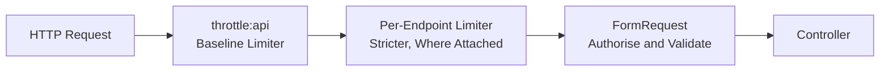

# Rate Limiting

The API answers every `/api` request through a rate limiter, and the public
`/status`, `/app-info`, `/health`, and `/csp-reports` surfaces carry their own.
This page is the runbook: what is limited, how a key is built, where the
counters live, and which ceilings are deliberate. The definitions are the source
of truth - the limiter closures in
[`AppServiceProvider::configureApiRateLimiting()`](../app/Providers/AppServiceProvider.php),
the allowances in [`config/api.php`](../config/api.php), and their attachment in
[`routes/api.php`](../routes/api.php) - so read the code when this page and the
code disagree.

Three properties shape every key. The baseline and the outbound-emitting
limiters key on the User ID, falling back to the caller's address only for a
guest; the credential limiters on an authenticated route key on the User ID
**with** the address appended, so two Users behind one NAT address (or one
office) do not share a bucket. Login adds an address-independent per-account
bucket. Every address in a key is run through
[`App\Support\IpAddress::normalise()`](../app/Support/IpAddress.php), which
collapses IPv6 to its `/64` network - see [IPv6 Callers](#ipv6-callers) - and the
address itself is resolved through the trusted-proxy configuration - see
[Resolving the Caller](#resolving-the-caller).

---

## Standards

| Source | What It Requires | How This API Meets It |
| ---------------------------------------------------------------------------------------------------------------------------------------------------------- | ---------------------------------------------------------------------------------------------------------------------------------------------------------------------- | ---------------------------------------------------------------------------------------------------------------------------------------------------------------------------------------------------------------------------------------------------------------------------------------------------------------------------- |
| [OWASP API4:2023 Unrestricted Resource Consumption](https://owasp.org/API-Security/editions/2023/en/0xa4-unrestricted-resource-consumption/)                | A limit on how often a client may call the API within a defined timeframe, keyed on client identity; stricter limits on sensitive endpoints; allowances documented and configurable | The `throttle:api` baseline covers the authenticated group, every credential surface carries a stricter per-endpoint limiter, keys are built from the identity plus the address, login also carries an address-independent per-account bucket, and every allowance is read from `config/api.php` and listed in [`.env.example`](../.env.example) |
| [RFC 9110 Section 15.5.30](https://www.rfc-editor.org/rfc/rfc9110.html#name-429-too-many-requests)                                                          | `429 Too Many Requests` is the status for a client that sent too many requests in a given time                                                                         | Every limiter answers `429`, rendered as the standard API envelope with `message: "Too Many Requests"`                                                                                                                                                                                                                      |
| [RFC 9110 Section 10.2.3](https://www.rfc-editor.org/rfc/rfc9110.html#name-retry-after)                                                                     | `Retry-After` tells a client how long to wait before retrying                                                                                                           | Sent on every `429`: `ApiExceptionRenderer::renderThrottle()` copies the headers the framework built on the exception onto the envelope, so `Retry-After` (and `X-RateLimit-Reset`) survive                                                                                                                                    |
| [draft-ietf-httpapi-ratelimit-headers](https://datatracker.ietf.org/doc/draft-ietf-httpapi-ratelimit-headers/)                                              | Would standardise `RateLimit-Limit`, `RateLimit-Remaining`, and `RateLimit-Reset`                                                                                      | The de-facto `X-RateLimit-Limit` and `X-RateLimit-Remaining` are sent on every response that passes a limiter and on the `429`; the draft's names are not sent                                                                                                                                                                 |

---

## How Limiting Works

Two layers guard the API surface. The baseline limiter is attached to the
authenticated route group, so every route inside it is covered even when it
declares nothing else. The credential and telemetry surfaces add a stricter
per-endpoint limiter on top, and the budgets are counted separately: a route
carrying both must satisfy the tighter one.



### Resolving the Caller

Every key that contains an address, and the address written to the audit trail,
comes from `$request->ip()`. That value is the socket peer until the framework is
told which proxies to trust. The list is resolved by
[`App\Support\TrustedProxies`](../app/Support/TrustedProxies.php) and applied in
[`bootstrap/app.php`](../bootstrap/app.php), in this order:

1. `TRUSTED_PROXIES` when set - the per-deployment override, which wins in every
   environment.
2. `TRUSTED_PROXIES_{ENVIRONMENT}` otherwise - the deployed default, e.g.
   `TRUSTED_PROXIES_PRODUCTION` or `TRUSTED_PROXIES_STAGING`. Fill it with the
   load balancer's subnets plus the CDN's published ranges, IPv6 included:
   Laravel resolves both families through the same Symfony CIDR matcher, so
   `2400:cb00::/32` is trusted exactly like its IPv4 counterpart.
3. Nothing at all for `local`, for `testing`, and for any environment that
   cannot be named: a directly exposed app trusts nothing, which is the safe
   posture.

The resolved list is never `*`. A wildcard would let clients spoof
`X-Forwarded-For` and bypass every IP limit, so it is dropped from the override
and from an environment default alike.

A deployed task that leaves both unset records the load balancer's address for
every request: all callers share one per-address bucket, and one caller can spend
everyone's sign-in allowance. Filling the environment default is the fix.
Verify the deployed value with `GET /api/me` and an audit row rather than
assuming it.

The resolver reads the **process** environment with `getenv()`, not `config()`:
`bootstrap/app.php` resolves the list while the application is being configured,
before the container has a `config` binding or has loaded `.env`. Export the
variables into the process (a container `environment:` block, a systemd
`Environment=`, a shell export); a value that exists only in `.env` is not
visible at that point.

### IPv6 Callers

An ISP hands one subscriber a `/64`, and the subscriber may use any of 2^64
addresses inside it. Keying on the raw address would let one IPv6 caller mint a
fresh bucket with every request, so the limit would be unenforceable rather than
merely imprecise. Every address-derived key therefore runs the address through
`App\Support\IpAddress::normalise()`:

| Input | Normalised To | Why |
| --- | --- | --- |
| `203.0.113.7` | `203.0.113.7` | IPv4 is returned unchanged: one address is one subscriber |
| `2001:DB8::1` | `2001:db8::/64` | IPv6 collapses to its `/64` network, and the text form is canonicalised |
| `2001:db8::dead:beef` | `2001:db8::/64` | A second host in the same `/64` shares the bucket |
| `2001:db8:0:1::1` | `2001:db8:0:1::/64` | A host in the next `/64` gets its own bucket |
| `::ffff:203.0.113.7` | `203.0.113.7` | An IPv4-mapped address is unwrapped, or every mapped caller would share `::/64` |

The `/64` split is where the address's subnet prefix ends and its interface
identifier begins ([RFC 4291 section 2.5.1](https://www.rfc-editor.org/rfc/rfc4291#section-2.5.1)),
so it is the standard-subscriber boundary rather than an arbitrary cut. Output is
the canonical text form `inet_ntop()` produces, which matches
[RFC 5952](https://www.rfc-editor.org/rfc/rfc5952) - lowercase, zeroes
compressed - so two spellings of one network cannot land in two buckets. The
rate-limit tests use the `2001:db8::/32` documentation prefix
([RFC 3849](https://www.rfc-editor.org/rfc/rfc3849)) for caller addresses, so no
case depends on an address being routable.

---

## Baseline Limiter

The baseline is a per-identity floor that applies to every authenticated route.

| Property | Value |
| --- | --- |
| Laravel name | `api` |
| Attached to | the authenticated route group (`routes/api.php`) |
| Key | the User ID; the caller's normalised address for a guest |
| Default | 500 requests per minute |
| Env var | `API_RATE_LIMIT_PER_MINUTE` |
| Config key | `api.rate_limit_per_minute` |
| Defined in | `AppServiceProvider::configureApiRateLimiting()` |

### Why 500 Per Minute Is Generous

The baseline is a safety floor, not a shaping policy: it must not obstruct a
legitimate client polling the API from a single address, while still bounding a
runaway loop or a hostile caller. Lower `API_RATE_LIMIT_PER_MINUTE` for a tighter
floor, or raise it for a high-volume internal consumer.

The allowance is not what makes the counters work. In the PHPUnit suite the app
runs the `array` cache store, so counters live inside one PHP process; only a
shared store makes the limits real. See [Where the Counters Live](#where-the-counters-live).

---

## Per-Endpoint Limiters

Each limiter below is attached to specific routes in [`routes/api.php`](../routes/api.php)
and runs in addition to the baseline. The credential-plus-address shape carries
the anti-abuse intent, and the separate per-address ceiling stops one address
hammering many different accounts. Every `address` below is the normalised form
from [IPv6 Callers](#ipv6-callers).

| Limiter | Routes | Key | Allowance | Env Vars |
| --- | --- | --- | --- | --- |
| `api-auth-login` | `POST /auth/login`, `POST /auth/login/remember` | `email\|address`, plus a per-account bucket keyed on the e-mail alone, plus the address ceiling | 5/min, account 10/min, ceiling 20/min | `API_AUTH_RATE_LIMIT_PER_MINUTE`, `API_AUTH_LOGIN_ACCOUNT_RATE_LIMIT_PER_MINUTE`, `API_AUTH_LOGIN_IP_CEILING_PER_MINUTE` |
| `api-auth-register` | `POST /auth/register` | `email\|address` plus the address ceiling | 5/min, ceiling 10/min | `API_AUTH_RATE_LIMIT_PER_MINUTE`, `API_AUTH_REGISTER_IP_CEILING_PER_MINUTE` |
| `api-auth-password` | `POST /auth/forgot-password`, `POST /auth/reset-password` | `email\|address` plus the address ceiling | 5/min, ceiling 20/min | `API_PASSWORD_RESET_RATE_LIMIT_PER_MINUTE`, `API_PASSWORD_RESET_IP_CEILING_PER_MINUTE` |
| `api-client-auth` | `POST /oauth/token` | `client_id\|address` plus the address ceiling | 5/min, ceiling 20/min | `API_CLIENT_AUTH_RATE_LIMIT_PER_MINUTE`, `API_CLIENT_AUTH_IP_CEILING_PER_MINUTE` |
| `api-auth-two-factor-send` | `POST /auth/two-factor/send` | hashed token or session ID plus the address, plus the address ceiling | 5/min, ceiling 20/min | `API_TWO_FACTOR_SEND_RATE_LIMIT_PER_MINUTE`, `API_TWO_FACTOR_SEND_IP_CEILING_PER_MINUTE` |
| `api-auth-two-factor-verify` | `POST /auth/two-factor/verify` | hashed token or session ID plus the address, plus the address ceiling | 5/min, ceiling 20/min | `API_TWO_FACTOR_VERIFY_RATE_LIMIT_PER_MINUTE`, `API_TWO_FACTOR_VERIFY_IP_CEILING_PER_MINUTE` |
| `api-auth-two-factor-status` | `GET /auth/two-factor/status` | hashed token or session ID plus the address, plus the address ceiling | 60/min, ceiling 60/min | `API_TWO_FACTOR_STATUS_RATE_LIMIT_PER_MINUTE`, `API_TWO_FACTOR_STATUS_IP_CEILING_PER_MINUTE` |
| `auth-verification` | `POST /auth/email/resend` | User ID plus the address | 3/min | `API_EMAIL_VERIFICATION_RATE_LIMIT_PER_MINUTE` |
| `email-verify` | `GET /auth/email/verify/{id}/{hash}` | the address ceiling only | ceiling 15/min | `API_EMAIL_VERIFY_IP_CEILING_PER_MINUTE` |
| `auth-password-change` | `PATCH /me/password` | User ID plus the address, plus the address ceiling | 5/min, ceiling 15/min | `API_AUTH_RATE_LIMIT_PER_MINUTE`, `API_AUTH_PASSWORD_IP_CEILING_PER_MINUTE` |
| `auth-sessions-revoke` | `DELETE /sessions/current`, `DELETE /sessions/others`, `DELETE /sessions/{web_session}` | User ID plus the address, plus the address ceiling | 5/min, ceiling 15/min | `API_AUTH_RATE_LIMIT_PER_MINUTE`, `API_AUTH_PASSWORD_IP_CEILING_PER_MINUTE` |
| `api-tokens` | `POST /tokens`, `POST /users/{user}/tokens` | the User ID; the caller's address for a guest | 10/min | `API_TOKEN_RATE_LIMIT_PER_MINUTE` |
| `api-webhooks` | the outbound-emitting webhook routes (create, test ping, rotate secret) | the User ID; the caller's address for a guest | 10/min | `API_WEBHOOK_RATE_LIMIT_PER_MINUTE` |
| `api-status` | `GET /status`, `GET /app-info` | the address | 30/min | `API_STATUS_RATE_LIMIT_PER_MINUTE` |
| `health` | `GET /health` (the `web` group) | the address | 60/min | `API_HEALTH_RATE_LIMIT_PER_MINUTE` |
| `csp-reports` | `POST /csp-reports` | the address ceiling only | ceiling 60/min | `API_CSP_REPORT_IP_CEILING_PER_MINUTE` |

### Why Login Carries Two Extra Buckets

`email|address` bounds one account per source address, but an attacker who
rotates addresses buys a fresh allowance with every address. Two extra buckets
close that:

- **The per-account bucket** keys on the lowercased e-mail alone, so the account's
  total attempt budget holds however the caller spreads across addresses. It is
  deliberately broader than the composite (10/min against 5/min) so a legitimate
  User on two devices is not locked out, and it is joined **only when the request
  carries an e-mail**: the same limiter covers `POST /auth/login/remember`, whose
  restore request carries none, and an always-on key would drop every such caller
  into one platform-wide empty bucket. An attacker can still spend a victim's
  per-account allowance - that is the accepted cost of any account-keyed limit -
  and the victim's own address stays gated by the composite.
- **The per-address ceiling** bounds the spread: a credential-stuffing attempt
  that rotates addresses within one network still hits it. It is intentionally
  broader than the composite so a NAT full of legitimate Users is not locked out
  by one careless client.

The per-address ceiling is dropped when `APP_ENV=local` because the test suite
drives many requests from one address. A local green run therefore says nothing
about the ceiling: prove it against a deployed environment or a shared store.

### Why the Telemetry Routes Are Per-Address

`/status`, `/health`, and `/app-info` serve no principal to key on, so they use
the address alone with allowances sized for polling. `/health` is throttled at
60/min, which is generous for a probe interval but not unlimited - if a
platform's health check ever polls faster than that, raise the allowance rather
than removing the limiter.

---

## Where the Counters Live

`Illuminate\Cache\RateLimiter` takes a cache repository, and the container binds
it to the `cache.limiter` store when that key is set, falling back to the default
store otherwise. This application does not set `cache.limiter`, so counters live
in `config('cache.default')`, which is `CACHE_STORE` - `redis` in the shipped
[`.env.example`](../.env.example), `database` when the variable is unset
([`config/cache.php`](../config/cache.php), table created by
[`0001_01_01_000001_create_cache_table.php`](../database/migrations/0001_01_01_000001_create_cache_table.php)),
`file` in CI ([`.env.ci`](../.env.ci)), and `array` in the PHPUnit suite
([`phpunit.xml`](../phpunit.xml) and [`.env.testing.local`](../.env.testing.local)).

That matters for three reasons.

- **Autoscaling is safe only with a shared store.** Every task shares one counter
  set through the `cache` table. A per-process store (`array`, or `file` on an
  ephemeral filesystem) gives each task its own counters and multiplies every
  allowance by the task count.
- **Concurrent hits are counted correctly.** The database store increments under
  a `lockForUpdate()` transaction, so two processes cannot both read the same
  value and write the same successor.
- **A green PHPUnit run only proves what the store it uses can prove.** Almost
  every suite pins `CACHE_STORE=array`, so a limit that existed only inside the
  test process would pass there. `ApiRateLimitSharedStoreTest` boots with
  `CACHE_STORE=database` and asserts the limiter's counter row lands in the
  `cache` table, which is what makes an allowance real where the app is served.

---

## Responses and Headers

The header set is the framework's; the renderer now carries it across to the
envelope.

| Header | When It Appears | Form |
| --- | --- | --- |
| `X-RateLimit-Limit` | every response that passes a limiter, and on a `429` | the maximum attempts for that limiter |
| `X-RateLimit-Remaining` | every response that passes a limiter, and on a `429` | attempts left in the window, or `0` on the exhausted one |
| `Retry-After` | on a `429` | RFC 9110 delay-seconds (the framework's own value) |
| `X-RateLimit-Reset` | on a `429` | UNIX timestamp when the window ends |

`ApiExceptionRenderer::renderThrottle()` builds the standard envelope and then
copies `ThrottleRequestsException::getHeaders()` onto it, casting the attempt
counts to strings. Without that copy a throttled client has no interval to wait
and retries immediately, spending the next window as well.

A route that carries two limiters advertises the tighter one, because the
framework keeps whichever `X-RateLimit-Remaining` is lower. The exhausted
response body is the standard envelope:

```json
{
  "status": "error",
  "status_code": 429,
  "message": "Too Many Requests",
  "data": null,
  "meta": {}
}
```

Verified against the running app, with a deliberately exhausted login limit:

```bash
# a passing response advertises its limiter
curl -sS -D - -o /dev/null http://localhost:8090/api/status | grep -i ratelimit
#   X-RateLimit-Limit: 30
#   X-RateLimit-Remaining: 29

# five rejected logins spend the composite budget, the sixth is throttled
for i in 1 2 3 4 5 6; do
  curl -sS -o /dev/null -w "%{http_code} " -X POST http://localhost:8090/api/auth/login \
    -H 'Content-Type: application/json' -H 'Accept: application/json' \
    -d '{"email":"ratelimit-doc-probe@example.com","password":"Wrong-Password-123"}'
done
#   422 422 422 422 422 429

# the 429 carries the advisory headers
curl -sS -D - -o /dev/null -X POST http://localhost:8090/api/auth/login \
  -H 'Content-Type: application/json' -H 'Accept: application/json' \
  -d '{"email":"ratelimit-doc-probe@example.com","password":"Wrong-Password-123"}' \
  | grep -iE 'HTTP/|retry-after|x-ratelimit'
#   HTTP/1.1 429 Too Many Requests
#   X-RateLimit-Limit: 5
#   X-RateLimit-Remaining: 0
#   Retry-After: 60
#   X-RateLimit-Reset: 1791475228
```

> Retry only once the wait has elapsed. Retrying immediately consumes the next
> window as well, so a client that ignores the interval keeps itself locked out
> for longer than the original wait.

---

## Coverage Gaps

Every `/api` route is covered by the baseline, and the credentials, telemetry,
and webhook surfaces carry their own limiter. The rest is deliberate.

| Path | Limiting | Why |
| --- | --- | --- |
| `GET /api/docs`, `GET /api/openapi.yaml` | none | Static content, fetched once per session; the interactive reference must not throttle while a reader explores it |
| `GET /.well-known/security.txt` | none | Static, and a security control that must always answer |
| The welcome page (`GET /`) | none | A static landing view (`view('welcome')`); it serves no data and no principal |

Edge protection (Cloudflare's own rate limiting and WAF) belongs in front of
anything above; the application-level limiter is the one that survives a change
of edge.

---

## Gaps to Close

Every gap from the previous revision of this page is closed: the `429` carries
the advisory headers, IPv6 callers are bucketed by `/64`, login has an
address-independent per-account bucket, `ApiRateLimitSharedStoreTest` proves a
counter reaches a shared store, and the trusted-proxy list has per-environment
defaults. Each was verified against the current tree.

One limitation remains, recorded rather than silently accepted:

| Limitation | Evidence | Closing It |
| --- | --- | --- |
| The proxy list is read from the process environment only | `bootstrap/app.php` resolves it while the application is configured, before `.env` is loaded, so a value written only to `.env` is ignored | Move the trust-proxy resolution after bootstrap (a provider setting `TrustProxies::at()` from `config()`), which changes when the list is applied and needs its own test of every environment |

---

## Adding a Limiter

1. Attach it in [`routes/api.php`](../routes/api.php) - `->middleware('throttle:{name}')` on the route, or on the group for a shared floor.
2. Define `RateLimiter::for('{name}', ...)` in `AppServiceProvider::configureApiRateLimiting()`.
3. Build the address segment with `IpAddress::normalise($request->ip())`, never the raw address, and consider whether the endpoint needs an account-keyed bucket or a broader ceiling.
4. Read the allowance from `config()->integer('api.{key}')` so a deployment can tune it without a code change.
5. Add the key to [`config/api.php`](../config/api.php) and the variable to [`.env.example`](../.env.example) with a one-line comment.
6. Add a row to the tables above, and record any deliberate omission under **Coverage Gaps**.

---

## Related

| Doc or File | Purpose |
| --- | --- |
| [config/api.php](../config/api.php) | Every allowance, with the comment explaining each ceiling |
| [AppServiceProvider](../app/Providers/AppServiceProvider.php) | The limiter closures and the key helpers |
| [IpAddress](../app/Support/IpAddress.php) | IPv6 `/64` aggregation for address-derived keys |
| [TrustedProxies](../app/Support/TrustedProxies.php) | Resolving the caller behind a load balancer |
| [routes/api.php](../routes/api.php) | Which limiter is attached where |
| [ApiExceptionRenderer](../app/Support/ApiExceptionRenderer.php) | How a throttle becomes the standard envelope, headers included |
| [docs/testing.md](testing.md) | The gates, suites, and coverage floor |
| [docs/permissions.md](permissions.md) | Roles, permissions, and what each route requires |
