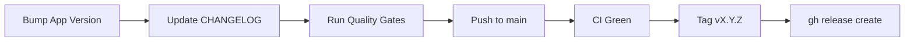

# Releasing Laravel API Skeleton

How to cut a release of **this** repo, in order, with the check that proves each
step. Written to be followed literally by a human or an agent.

For GitHub release note formatting (emoji section headings, **Full Changelog**
footer), follow the **create-github-release** skill in your conventions toolkit.
This runbook is the surrounding procedure - gates, changelog, tag, and publish.

- **Prerequisites:** `gh` authenticated against `Aontaigh/laravel-api-skeleton`
  (`gh auth status`); push access to `main`; Docker for Sail when host PHP is not 8.5.
- **Versioning:** semver. New endpoints or conventions are a **minor**; docs, test
  refactors, and dependency patches are a **patch**; breaking API or convention changes
  are a **major**.

## Release Checklist

- [ ] 1. App version bumped - `composer.json`, `docs/openapi.yaml`, `.env.example` / `.env.ci`, and changelog (see [App version](#app-version))
- [ ] 2. `CHANGELOG.md` updated - `## [X.Y.Z] - YYYY-MM-DD` with today's date
- [ ] 3. Quality gates green locally (see below)
- [ ] 4. Release commit pushed to `main`, CI green **on that commit**
- [ ] 5. Tag `vX.Y.Z` on the CI-green commit and push
- [ ] 6. GitHub release published per [GitHub release format](#github-release-format) (emoji
  section headings, unwrapped bullets, **Full Changelog** footer - do not paste
  `CHANGELOG.md` verbatim)

## Release Flow



## App Version

The `/health` endpoint reports the app version from `config('app.version')`. That
value defaults to the **`version` field in `composer.json`** - not a hard-coded
fallback in `config/app.php`. Keep these in sync on every release:

| File | What to update |
| --- | --- |
| [`composer.json`](../composer.json) | `"version": "X.Y.Z"` - **source of truth** |
| [`docs/openapi.yaml`](../docs/openapi.yaml) | `info.version`, the `HealthSuccess` example, and the `HealthData.version` schema example |
| [`.env.example`](../.env.example) and [`.env.ci`](../.env.ci) | Commented `# APP_VERSION=X.Y.Z` placeholder in the Application section (documents the optional override; keep in sync with `composer.json` on every release) |
| Git tag | `vX.Y.Z` (must match composer version without the `v` prefix) |

`APP_VERSION` in `.env` is an optional override for deployed environments. Local
dev and CI do not need it when `composer.json` is current. The commented
placeholder in `.env.example` is operator documentation only - it is not
enforced by CI, so update it manually when bumping the version.

CI enforces sync via `composer verify:version` (also part of `composer ci`):

```bash
composer verify:version
# or: php scripts/verify-app-version.php
```

The script fails when OpenAPI drifts from `composer.json`, or when a tagged GitHub
Actions build (`GITHUB_REF_NAME=vX.Y.Z`) does not match the composer version.

## 1. Update the Changelog

`CHANGELOG.md` follows [Keep a Changelog](https://keepachangelog.com/en/1.1.0/).
Rename `## [Unreleased]` to `## [X.Y.Z] - YYYY-MM-DD`, add a fresh empty
`## [Unreleased]` above it, and update the footer compare links at the bottom.

Use **plain** section headings in this file (`### Added`, `### Changed`) - emoji
headings are for the GitHub release only.

## 2. Run the Quality Gates

> [!IMPORTANT]
> Discover commands from this repo - do not assume another project's gates. Primary
> sources: [`.github/workflows/ci.yml`](../.github/workflows/ci.yml) and `composer.json`
> scripts.

Local (Sail when host PHP is not 8.5):

```bash
./vendor/bin/sail composer ci
./vendor/bin/sail artisan migrate:fresh --seed --force
bash scripts/verify-openapi-examples.sh
```

`composer ci` runs Pint, Larastan, PHPUnit with the 90% coverage gate, app version
sync (`composer verify:version`), and `composer audit`. OpenAPI example verification
is a **separate** CI job - run it locally before tagging when API or docs changed.

See [README Quality Gates](../README.md#quality-gates) for the full command list and
Sail port notes when Docker ports on your machine are already in use.

## 3. Commit and Push, Then Wait for CI

Stage everything the release ships. When the feature work is already committed,
the release bump touches only these paths:

```bash
git add CHANGELOG.md composer.json docs/ .env.example .env.ci
```

When the release carries uncommitted feature work, stage the working tree too -
the tag must point at a commit that contains both the feature and the version
bump, and a release-files-only commit would let CI green-light a `main` that
still lacks the feature:

```bash
git add -A
git commit -m "chore(release): prepare vX.Y.Z"
git push origin main
gh run watch --exit-status
```

Push and tag with the account that holds write access to the repository - the
publisher token needs push on `main` and release creation, so verify
`gh auth status` before step 3 rather than at the release step.

CI must be green on the commit you are about to tag. The **All Quality Gates** summary
job must pass - Pint, app version sync, Larastan, PHPUnit + coverage, Security Audit,
Semgrep, Zizmor, and OpenAPI Examples.

## 4. Tag the CI-Green Commit

```bash
git fetch --tags origin
git rev-parse main            # note this SHA
git tag -a vX.Y.Z -m "Release vX.Y.Z"
git push origin vX.Y.Z
git rev-parse vX.Y.Z          # must equal the SHA above
```

> [!WARNING]
> Tag only after CI passes on **that** commit - not an earlier changelog-only push that
> failed a gate.

## 5. Publish the GitHub Release

Draft notes from the `## [X.Y.Z]` changelog section. GitHub release notes are **not** a
copy of `CHANGELOG.md` - they follow a separate layout so they render cleanly on the
[Releases](https://github.com/Aontaigh/laravel-api-skeleton/releases) page.

### GitHub release format

| Rule | `CHANGELOG.md` | GitHub release |
| --- | --- | --- |
| Version heading | `## [1.14.0] - 2026-09-11` | **Omit** - the tag title (`v1.14.0`) is the heading |
| Section headings | `### Added` (plain) | `### ✅ Added` (emoji + Title Case) |
| Section headings | `### Changed` | `### 🔄 Changed` |
| Section headings | `### Fixed` | `### 🐛 Fixed` |
| Section headings | `### Removed` | `### ❌ Removed` |
| Footer | Compare link in file footer | `**Full Changelog**` block at the end of the notes (see below) |

Use **only** the emoji section headings above. Do not publish plain `## Added` /
`## Changed` headings or paste the Keep a Changelog version line into the release body.

**Unwrap the bullets before publishing.** GitHub release notes preserve single newlines as
line breaks (they render like issue comments, not like READMEs), so pasting `CHANGELOG.md`'s
hard-wrapped lines verbatim re-wraps every bullet at the changelog's ~95-character column -
a ragged right edge that never extends to the container's full width. Join each bullet's
continuation lines into one flowing line per bullet (headings, blank lines, and the
`**Full Changelog**` footer stay on their own lines); GitHub then reflows each bullet to the
full container width.

Omit empty sections. Keep section order: Added, Changed, Fixed, Removed.

End every release **after `v1.0.0`** with a horizontal rule and compare link:

```markdown
---

**Full Changelog**: [vPREV...vX.Y.Z](https://github.com/Aontaigh/laravel-api-skeleton/compare/vPREV...vX.Y.Z)
```

The initial `v1.0.0` release has no prior tag, so it ends after the last bullet with no
footer.

### Example (patch release)

```markdown
### 🔄 Changed

- `.github/renovate.json` - `minimumReleaseAge` at root scope (Semgrep-compliant without per-rule exceptions)
- CI workflow-lint job validates Renovate config with `renovate-config-validator`

---

**Full Changelog**: [v1.14.0...v1.14.1](https://github.com/Aontaigh/laravel-api-skeleton/compare/v1.14.0...v1.14.1)
```

Reference: [v1.13.0](https://github.com/Aontaigh/laravel-api-skeleton/releases/tag/v1.13.0)
(minor with Added / Changed / Fixed) and
[v1.14.1](https://github.com/Aontaigh/laravel-api-skeleton/releases/tag/v1.14.1) (patch).

### Publish

```bash
gh release create vX.Y.Z \
  --repo Aontaigh/laravel-api-skeleton \
  --title "vX.Y.Z" \
  --notes-file /tmp/release-notes.md
gh release view vX.Y.Z --web
```

To fix an already-published release that used the wrong format:

```bash
gh release edit vX.Y.Z --notes-file /tmp/release-notes.md
```

For ticketless repos, bullet lines with commit or PR links match prior skeleton
releases - see [v1.3.0](https://github.com/Aontaigh/laravel-api-skeleton/releases/tag/v1.3.0).
