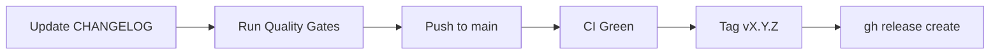

# Releasing Laravel API Skeleton

How to cut a release of **this** repo, in order, with the check that proves each
step. Written to be followed literally by a human or an agent.

For GitHub release note formatting (emoji section headings, **Full Changelog**
footer), follow the **create-github-release** skill in your conventions toolkit.
This runbook is the surrounding procedure — gates, changelog, tag, and publish.

- **Prerequisites:** `gh` authenticated against `Aontaigh/laravel-api-skeleton`
  (`gh auth status`); push access to `main`; Docker for Sail when host PHP is not 8.5.
- **Versioning:** semver. New endpoints or conventions are a **minor**; docs, test
  refactors, and dependency patches are a **patch**; breaking API or convention changes
  are a **major**.

## Release Checklist

- [ ] 1. `CHANGELOG.md` updated — `## [X.Y.Z] - YYYY-MM-DD` with today's date
- [ ] 2. Quality gates green locally (see below)
- [ ] 3. Release commit pushed to `main`, CI green **on that commit**
- [ ] 4. Tag `vX.Y.Z` on the CI-green commit and push
- [ ] 5. GitHub release published (transform changelog headings to emoji — do not paste
  `CHANGELOG.md` verbatim)

## Release Flow



## 1. Update the Changelog

`CHANGELOG.md` follows [Keep a Changelog](https://keepachangelog.com/en/1.1.0/).
Rename `## [Unreleased]` to `## [X.Y.Z] - YYYY-MM-DD`, add a fresh empty
`## [Unreleased]` above it, and update the footer compare links at the bottom.

Use **plain** section headings in this file (`### Added`, `### Changed`) — emoji
headings are for the GitHub release only.

## 2. Run the Quality Gates

> [!IMPORTANT]
> Discover commands from this repo — do not assume another project's gates. Primary
> sources: [`.github/workflows/ci.yml`](.github/workflows/ci.yml) and `composer.json`
> scripts.

Local (Sail when host PHP is not 8.5):

```bash
./vendor/bin/sail composer ci
./vendor/bin/sail artisan migrate:fresh --seed --force
bash scripts/verify-openapi-examples.sh
```

`composer ci` runs Pint, Larastan, PHPUnit with the 90% coverage gate, and
`composer audit`. OpenAPI example verification is a **separate** CI job — run it
locally before tagging when API or docs changed.

See [README Quality Gates](../README.md#quality-gates) for the full command list and
Sail port notes when Docker ports on your machine are already in use.

## 3. Commit and Push, Then Wait for CI

```bash
git add CHANGELOG.md README.md docs/
git commit -m "chore(release): prepare vX.Y.Z"
git push origin main
gh run watch --exit-status
```

CI must be green on the commit you are about to tag. The **All Quality Gates** summary
job must pass — Pint, Larastan, PHPUnit + coverage, Security Audit, and OpenAPI
Examples.

## 4. Tag the CI-Green Commit

```bash
git fetch --tags origin
git rev-parse main            # note this SHA
git tag -a vX.Y.Z -m "Release vX.Y.Z"
git push origin vX.Y.Z
git rev-parse vX.Y.Z          # must equal the SHA above
```

> [!WARNING]
> Tag only after CI passes on **that** commit — not an earlier changelog-only push that
> failed a gate.

## 5. Publish the GitHub Release

Draft notes from the `## [X.Y.Z]` changelog section. Transform headings:

| `CHANGELOG.md` | GitHub release |
| --- | --- |
| `### Added` | `### ✅ Added` |
| `### Changed` | `### 🔄 Changed` |
| `### Fixed` | `### 🐛 Fixed` |
| `### Removed` | `### ❌ Removed` |

End with:

```markdown
---

**Full Changelog**: [vPREV...vX.Y.Z](https://github.com/Aontaigh/laravel-api-skeleton/compare/vPREV...vX.Y.Z)
```

```bash
gh release create vX.Y.Z \
  --repo Aontaigh/laravel-api-skeleton \
  --title "vX.Y.Z" \
  --notes-file /tmp/release-notes.md
gh release view vX.Y.Z --web
```

For ticketless repos, bullet lines with commit or PR links match prior skeleton
releases — see [v1.3.0](https://github.com/Aontaigh/laravel-api-skeleton/releases/tag/v1.3.0).
